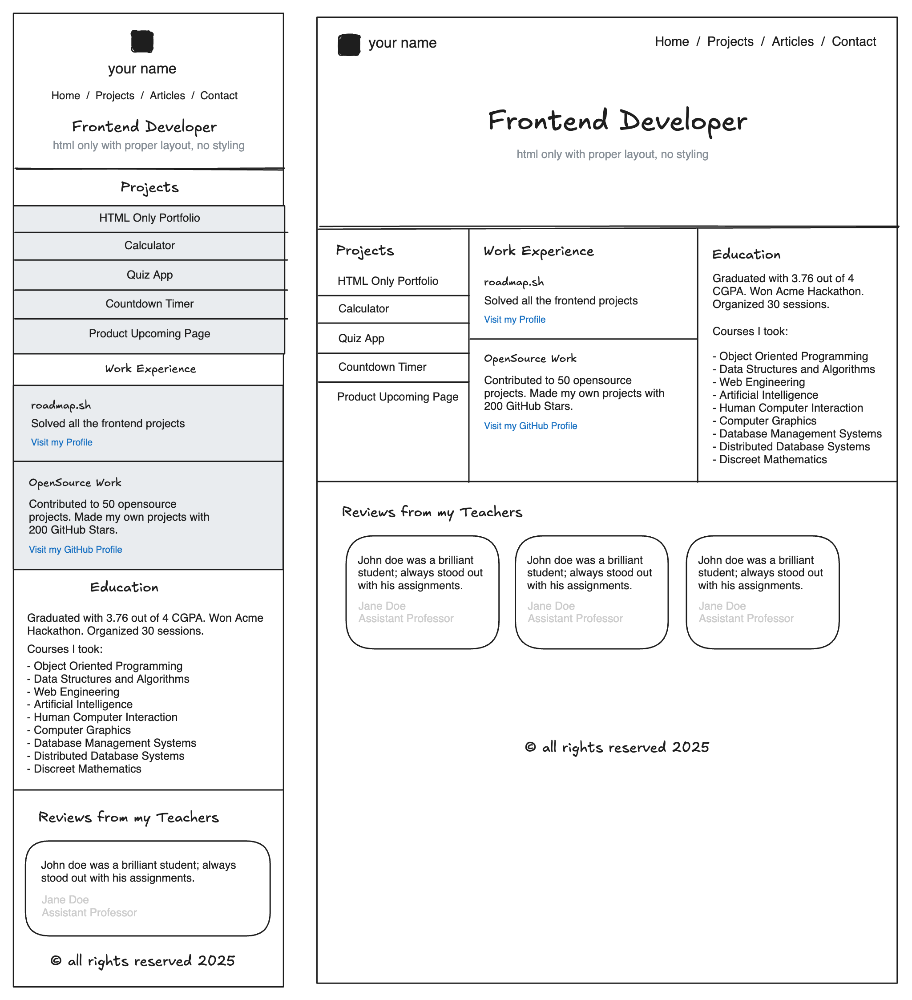

# Front-end Projects from Roadmap.sh

This repository contains front-end projects built following the [roadmap.sh](https://roadmap.sh/) front-end developer path.

## Projects List

[Basic HTML Website](https://roadmap.sh/projects/basic-html-website), [Personal Portfolio](https://roadmap.sh/projects/portfolio-website),\
[Changelog Component](https://roadmap.sh/projects/changelog-component), [Testimonial Cards](https://roadmap.sh/projects/testimonial-cards),\
[Datepicker UI](https://roadmap.sh/projects/datepicker-ui), [Accessible Form UI](https://roadmap.sh/projects/accessible-form-ui),\
[Image Grid Layout](https://roadmap.sh/projects/image-grid), [Tooltip UI](https://roadmap.sh/projects/tooltip-ui),\
[Simple Tabs](https://roadmap.sh/projects/simple-tabs), [Cookie Consent](https://roadmap.sh/projects/cookie-consent),\
[Restricted Textarea](https://roadmap.sh/projects/restricted-textarea), [Accordion UI](https://roadmap.sh/projects/accordion),\
[Custom Dropdown](https://roadmap.sh/projects/custom-dropdown), [Task Tracker](https://roadmap.sh/projects/task-tracker-js),\
[Github Random Repo](https://roadmap.sh/projects/github-random-repo), [Reddit Client](https://roadmap.sh/projects/reddit-client)\
[Temperature Converter](https://roadmap.sh/projects/temperature-converter)

Click any of the images below to view the readme and live demo of the project.

  
  

  
  

