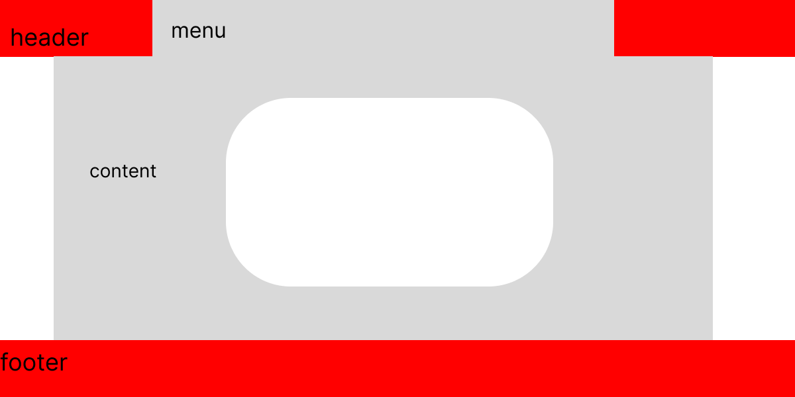

## Spesifikasi yang Dibutuhkan

- **Laptop/Komputer**: Spesifikasi minimum ("kentang") bisa digunakan.💻 🖥️
- **Internet**: Diperlukan untuk menginstal framework seperti Bootstrap atau Tailwind CSS. 모
- **Text Editor**: Saya menggunakan [Visual Studio Code](https://code.visualstudio.com/) yang sudah di-custom. 📝

## Apa yang Akan Kita Buat?

Kita akan membuat website sederhana dari nol berdasarkan video dari [Dea Af Rizal - Cuy University](https://www.youtube.com/channel/UCLf7K-5JikLmfMI2WudTGZg) (semester 1). Tampilan website yang akan kita buat cukup sederhana.

### Desain Website

Sebelum memulai coding, kita akan mendesain website terlebih dahulu. Aplikasi desain yang bisa digunakan bebas, seperti Figma, Adobe XD, atau bahkan menggunakan sketsa tangan.

  0. draw io: ```https://www.draw.io/```. 
  1. figma : ```https://www.figma.com/```. 
  2. lucid draw :```https://www.lucidchart.com/pages/```. 
  3. eraseroio: link :``` https://www.eraser.io/```.
  4. urlencode : ```https://www.urlencoder.org/```.


<br/>

ini untuk tampilan dari website tersebut.
