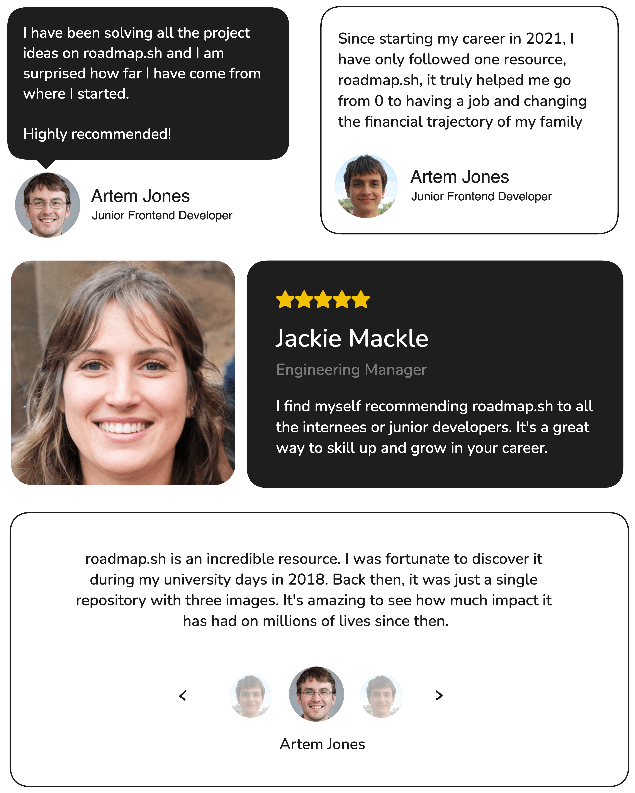

### Theme
Tema yang saya ambil berasal dari **Bootstrap** yang disimpan di `localStorage`. Ini merupakan peningkatan dari proyek sebelumnya. Kali ini, saya memiliki studi kasus terbaru yang akan saya bahas.

---

### Testimonial Card

Dalam proyek ini, kamu diminta untuk membuat beberapa **testimonial card**. Testimonial adalah kutipan atau pernyataan dari pelanggan atau pengguna yang puas, sering digunakan di situs web untuk membangun kredibilitas dan kepercayaan.

**Tujuan Proyek:**

Proyek ini bertujuan untuk mengajarkan kamu tentang **penempatan** dan **layout** dalam **CSS**. Di bawah ini adalah contoh mockup kasar yang menunjukkan beberapa testimonial card. Setiap kartu dirancang untuk membantu kamu memahami berbagai teknik tata letak dan penempatan.

Kamu bebas menggunakan konten dan gambar apa pun yang kamu suka untuk testimonial tersebut.

---

**Hasil yang Diharapkan:**

Setelah menyelesaikan proyek ini, kamu akan memiliki pemahaman yang lebih baik tentang cara membuat layout menggunakan HTML dan CSS. Kamu dapat meningkatkan keterampilanmu lebih jauh dengan mengeksplorasi proyek-proyek yang lebih kompleks seiring perkembanganmu.