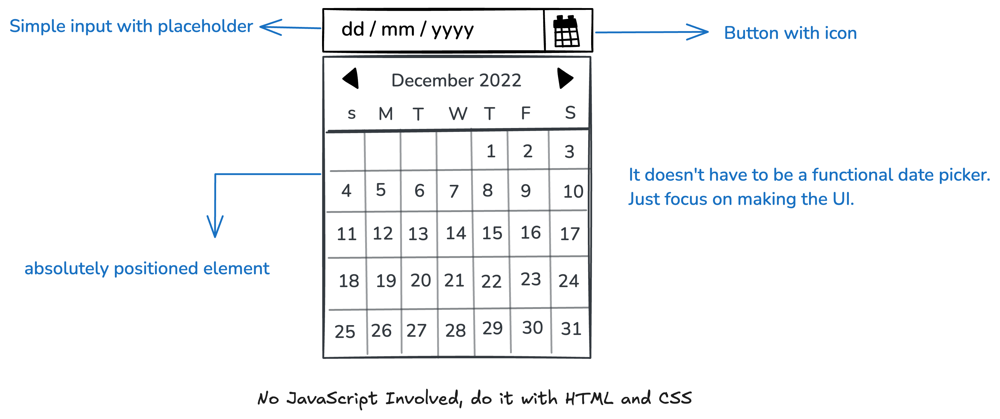

### Theme
Tema yang saya ambil berasal dari **Bootstrap** yang disimpan di `localStorage`. Ini merupakan peningkatan dari proyek sebelumnya. Kali ini, saya memiliki studi kasus terbaru yang akan saya bahas.

---

### datepicker

Dalam proyek ini, Anda diharuskan membuat UI datepicker sederhana hanya dengan menggunakan HTML dan CSS. Ini tidak akan menjadi datepicker yang fungsional, tetapi komponen UI statis yang nantinya dapat Anda tingkatkan dengan JavaScript.

**Tujuan Proyek:**

Tujuan dari proyek ini adalah untuk membantu Anda mempraktikkan teknik pemosisian, tata letak, dan gaya dalam CSS. Di bawah ini adalah mockup kasar yang menunjukkan UI datepicker yang perlu Anda buat.

Kamu bebas menggunakan konten dan gambar apa pun yang kamu suka untuk testimonial tersebut.

---

**Hasil yang Diharapkan:**

Meskipun versi ini tidak berfungsi, versi ini akan memberikan dasar yang kuat untuk membuat pemilih tanggal interaktif di proyek mendatang.