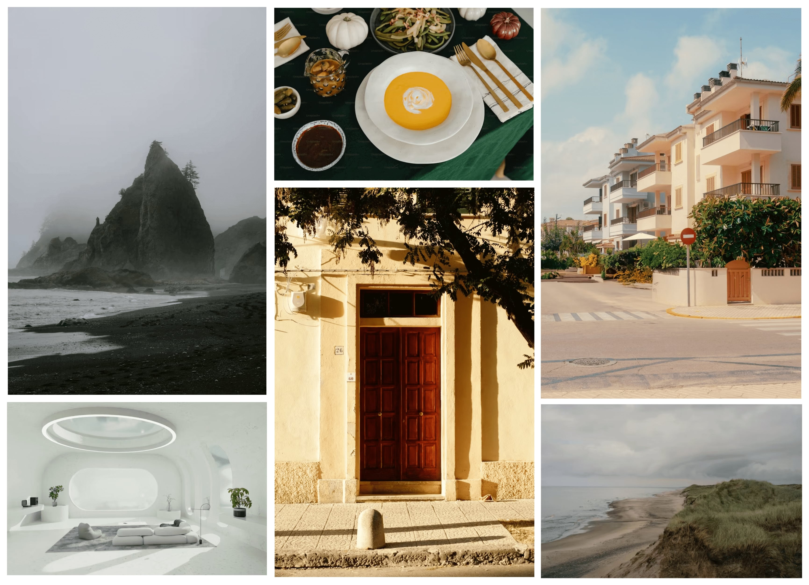

### Theme
Tema yang saya ambil berasal dari **Bootstrap** yang disimpan di `localStorage`. Ini merupakan peningkatan dari proyek sebelumnya. Kali ini, saya memiliki studi kasus terbaru yang akan saya bahas.

---

### image grid

Dalam proyek ini, Anda diharuskan membuat tata letak grid menggunakan HTML dan CSS. Anda akan diberikan enam gambar yang perlu disusun dalam pola grid berdasarkan mockup yang disediakan. Fokus utama proyek ini adalah membantu Anda mempelajari dan mempraktikkan teknik tata letak CSS Grid, yang penting untuk membuat tata letak web yang responsif dan fleksibel.

**Tujuan Proyek:**

Tujuan dari proyek ini adalah memberi Anda pengalaman langsung dengan CSS Grid, memungkinkan Anda membuat tata letak yang rumit dengan mudah. Di bawah ini adalah mockup kasar yang menunjukkan tata letak grid yang perlu Anda buat bersama dengan enam gambar yang harus Anda gunakan.

Kamu bebas menggunakan konten dan gambar apa pun yang kamu suka untuk testimonial tersebut.

---

**Pedoman Aksesibilitas**

Anda dapat menggunakan gambar yang sama yang disediakan di maket atau menggantinya dengan gambar Anda sendiri. Tata letak kisi harus responsif, artinya harus beradaptasi dengan berbagai ukuran layar dan mempertahankan desain yang menarik secara visual.

Tujuan pembelajaran utama dari proyek ini meliputi:

    Struktur Grid: Memahami dasar-dasar CSS Grid, termasuk mendefinisikan wadah grid, baris, kolom, dan cara menempatkan item di dalam grid.

    Desain Responsif: Pelajari cara membuat tata letak kisi menjadi responsif sehingga dapat beradaptasi dengan berbagai ukuran layar. Ini mungkin melibatkan perubahan jumlah kolom atau tata letak gambar berdasarkan lebar area pandang.

    Penyelarasan dan Penspasian: Jelajahi cara menyelaraskan item kisi dan mengatur jarak antar item untuk mendapatkan tata letak yang bersih dan menarik secara visual.

**Hasil yang Diharapkan:**

Meskipun versi ini tidak berfungsi, versi ini akan memberikan dasar yang kuat untuk membuat pemilih tanggal interaktif di proyek mendatang.