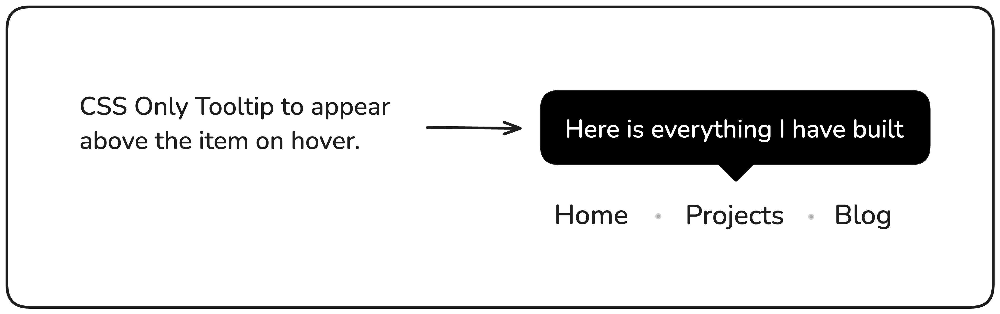

### Theme
Tema yang saya ambil berasal dari **Bootstrap** yang disimpan di `localStorage`. Ini merupakan peningkatan dari proyek sebelumnya. Kali ini, saya memiliki studi kasus terbaru yang akan saya bahas.

---

### Tooltip UI

Dalam proyek ini, Anda diharuskan membuat tooltip yang muncul di atas item navigasi saat diarahkan, hanya menggunakan HTML dan CSS. Tooltip adalah kotak pop-up kecil yang memberikan informasi tambahan tentang item navigasi saat pengguna mengarahkan kursor ke item tersebut. Proyek ini akan fokus pada penguasaan pemosisian CSS, efek hover, dan pembuatan tooltip yang menarik secara visual tanpa bergantung pada JavaScript.

**Tujuan Proyek:**

Tujuan proyek ini adalah membantu Anda memahami cara menggunakan CSS untuk efek UI dinamis. Anda akan mempelajari cara memposisikan elemen relatif satu sama lain, membuat transisi yang mulus, dan membuat navigasi Anda lebih interaktif dan ramah pengguna. Di bawah ini adalah mockup kasar yang memperlihatkan tooltip yang muncul di atas item navigasi.

Kamu bebas menggunakan konten dan gambar apa pun yang kamu suka untuk testimonial tersebut.

---

**Hasil yang Diharapkan:**

Meskipun versi ini tidak berfungsi, versi ini akan memberikan dasar yang kuat untuk membuat pemilih tanggal interaktif di proyek mendatang.