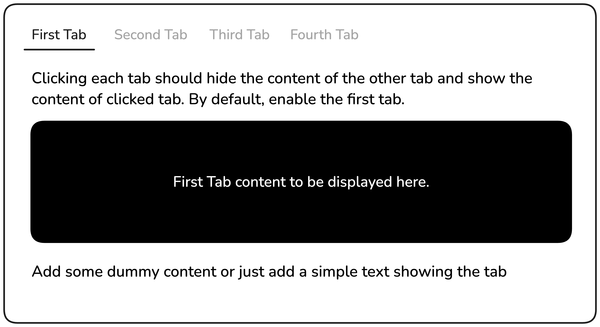

### Theme
theme yang saya pakai ini sedikit berbeda karena saya pakai ```tailwinds``` sebagai dasar theme saya. karena sudah bosan ya dengan bootstrap dari kemarin.

---

### Tabs

proyeknya dirancang untuk memperkenalkan Anda pada manipulasi DOM dasar dan penanganan kejadian di JavaScript.

Anda diharuskan membuat fungsionalitas tab sederhana menggunakan HTML, CSS, dan JavaScript dasar. Halaman tersebut akan memiliki empat tab, dengan tab pertama aktif secara default. Ketika pengguna mengklik tab lain, konten tab saat ini akan disembunyikan, dan konten tab yang dipilih akan ditampilkan.

**Tujuan Proyek:**




Kamu bebas menggunakan konten dan gambar apa pun yang kamu suka untuk testimonial tersebut.

---

**Hasil yang Diharapkan:**

Meskipun versi ini tidak berfungsi, versi ini akan memberikan dasar yang kuat untuk membuat pemilih tanggal interaktif di proyek mendatang.