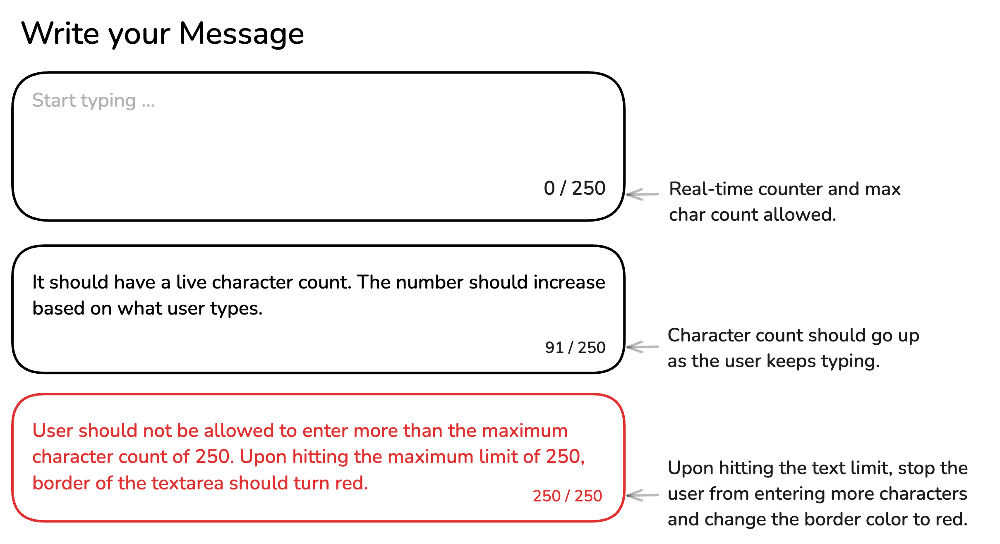

### Theme
theme yang saya pakai ini sedikit berbeda karena saya pakai tailwinds sebagai dasar theme saya. karena sudah bosan ya dengan bootstrap dari kemarin.

---

### Restricted Textarea

Anda diharuskan membuat textarea yang melacak dan menampilkan jumlah karakter yang diketik pengguna, beserta batas maksimal karakter. Saat pengguna mengetik, jumlah karakter akan diperbarui secara dinamis. Setelah batas tercapai, textarea akan mencegah input lebih lanjut dan batas akan berubah menjadi merah untuk secara visual menunjukkan batas telah tercapai.

**Tujuan Proyek:**

Kamu bebas menggunakan konten dan gambar apa pun yang kamu suka untuk testimonial tersebut.

---

**Hasil yang Diharapkan:**

Meskipun versi ini tidak berfungsi, versi ini akan memberikan dasar yang kuat untuk membuat pemilih tanggal interaktif di proyek mendatang.