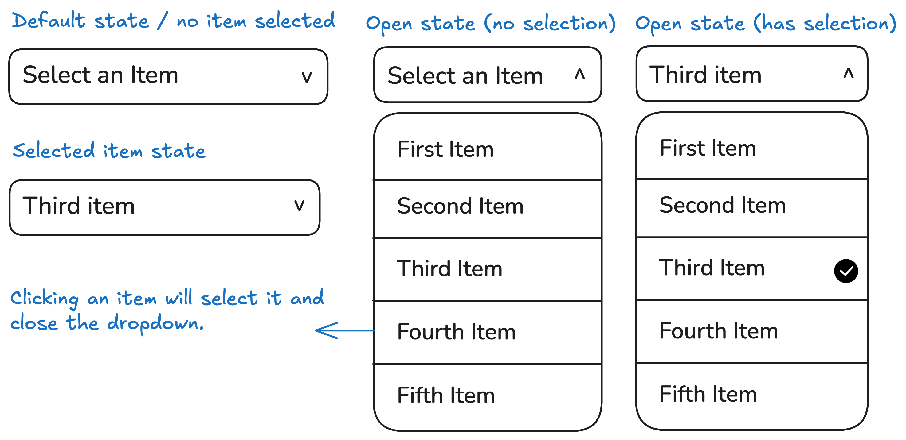

### Theme
theme yang saya pakai ini sedikit berbeda karena saya pakai tailwinds sebagai dasar theme saya. karena sudah bosan ya dengan bootstrap dari kemarin.

---

### dropdown

Anda akan membuat menu tarik-turun khusus yang memungkinkan pengguna memilih item dari daftar. Dropdown harus memiliki status default yang menampilkan teks placeholder, status terbuka yang menampilkan semua opsi, dan status terpilih tempat item yang dipilih ditampilkan. Ketika sebuah item dipilih, dropdown akan ditutup, dan item yang dipilih akan disorot.

Di bawah ini adalah maket yang memperlihatkan dropdown dalam keadaan default, terbuka, dan dipilih:

**Tujuan Proyek:**

Di bawah ini adalah mockup yang menunjukkan akordeon dalam keadaan default dan diperluas:

Kamu bebas menggunakan konten dan gambar apa pun yang kamu suka untuk testimonial tersebut.

---

**Hasil yang Diharapkan:**

Meskipun versi ini tidak berfungsi, versi ini akan memberikan dasar yang kuat untuk membuat pemilih tanggal interaktif di proyek mendatang.