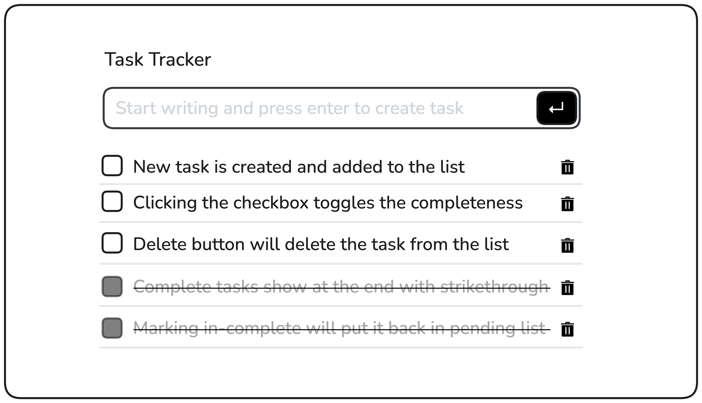

### Theme
theme yang saya pakai ini sedikit berbeda karena saya pakai tailwinds sebagai dasar theme saya. karena sudah bosan ya dengan bootstrap dari kemarin.

---

### Task Tracker

Anda diharuskan membuat pelacak tugas yang memungkinkan pengguna menambahkan tugas baru, menandainya sebagai selesai, atau menghapusnya. Tugas yang sudah selesai akan dipindahkan ke akhir daftar dan akan dicoret, dan pengguna dapat menghapus tanda tugas untuk mengembalikannya ke daftar tertunda.

Berikut ini mockup pelacak tugas:

**Tujuan Proyek:**

Di bawah ini adalah mockup yang menunjukkan akordeon dalam keadaan default dan diperluas:

Kamu bebas menggunakan konten dan gambar apa pun yang kamu suka untuk testimonial tersebut.

---

**Hasil yang Diharapkan:**

Simpan tugas Anda dalam array objek, di mana setiap objek mewakili tugas dengan properti seperti deskripsi dan status (selesai atau belum). Setiap kali tugas baru ditambahkan, diperbarui, dihapus, atau ditandai sebagai selesai/belum selesai, perbarui susunan tugas. Tulis fungsi renderTasks yang akan menghapus semua tugas dari DOM dan merender ulang tugas tersebut berdasarkan larik tugas yang diperbarui.

Proyek ini akan membantu Anda berlatih manipulasi array, penanganan event, dan pembaruan DOM dinamis menggunakan JavaScript.