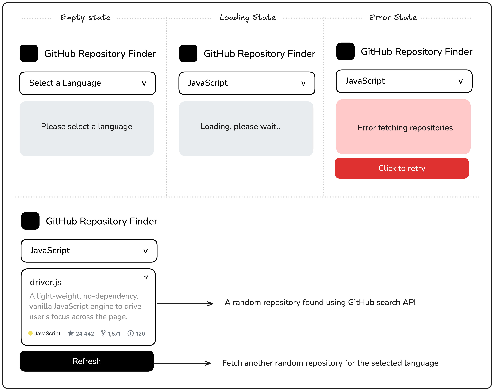

### Theme
theme yang saya pakai ini sedikit berbeda karena saya pakai tailwinds sebagai dasar theme saya. karena sudah bosan ya dengan bootstrap dari kemarin.

---

### GitHub Random Repository

Proyek ini dirancang untuk memperkenalkan Anda cara bekerja dengan API eksternal, menangani permintaan asinkron, dan mengelola status UI yang berbeda dengan JavaScript.

Anda akan membuat pencari repositori GitHub yang memungkinkan pengguna memilih bahasa pemrograman dari menu dropdown. Aplikasi kemudian akan menggunakan API Pencarian Repositori GitHub untuk mengambil dan menampilkan repositori acak yang cocok dengan bahasa yang dipilih. Informasi yang ditampilkan harus mencakup nama repositori, deskripsi, jumlah bintang, fork, dan masalah terbuka. Pengguna dapat mengambil repositori acak lainnya dengan mengklik tombol.

**Tujuan Proyek:**

Di bawah ini adalah mockup yang menunjukkan akordeon dalam keadaan default dan diperluas:

Kamu bebas menggunakan konten dan gambar apa pun yang kamu suka untuk testimonial tersebut.

---

**Hasil yang Diharapkan:**

Aplikasi harus menangani status pemuatan, pengosongan, dan kesalahan secara efektif. Setelah berhasil mengambil repositori, tombol “Refresh” akan muncul untuk memungkinkan pengguna mendapatkan repositori acak lainnya.

Berikut ini tautan ke sumber daya yang Anda perlukan untuk proyek ini:

    API Pencarian Repositori GitHub
    Data Bahasa Pemrograman

Proyek ini akan membantu Anda mempraktikkan integrasi API, mengelola data asinkron, dan meningkatkan pengalaman pengguna dengan status UI responsif.