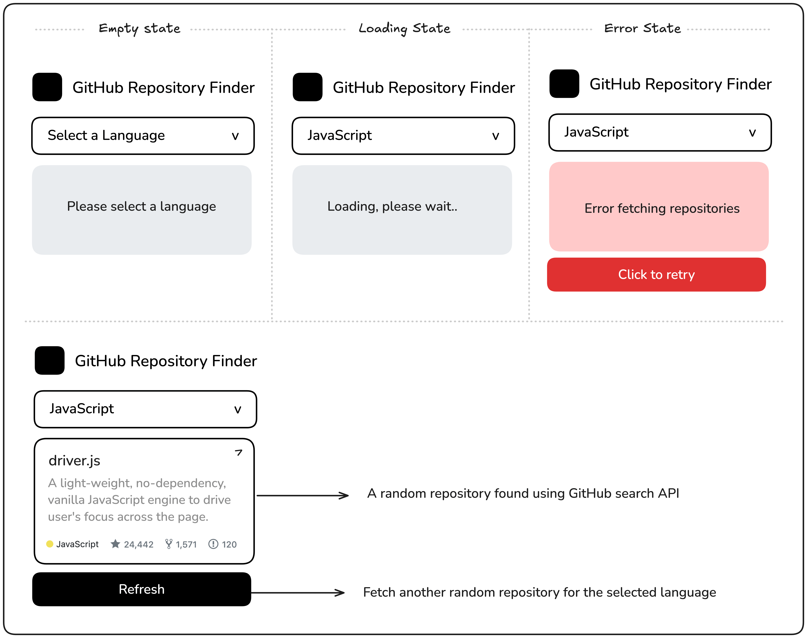

### Theme
theme yang saya pakai ini sedikit berbeda karena saya pakai tailwinds sebagai dasar theme saya. karena sudah bosan ya dengan bootstrap dari kemarin.

---

### Reddit Client 

Anda diharuskan membuat klien Reddit berbasis browser yang menampilkan beberapa subreddits di jalur terpisah dan dapat disesuaikan. Anda akan bekerja dengan umpan Reddit JSON untuk mengambil postingan dari subreddit yang berbeda dan menampilkannya dalam tata letak yang dinamis dan responsif.

Aplikasi ini akan memungkinkan pengguna untuk menambahkan jalur subreddit baru dengan memasukkan nama subreddit. Ini akan memverifikasi keberadaan subreddit, mengambil postingannya, dan menampilkannya di jalur baru. Setiap jalur akan menampilkan postingan subreddit, termasuk judul, penulis, dan penghitungan suara.

**Tujuan Proyek:**

Di bawah ini adalah mockup yang menunjukkan akordeon dalam keadaan default dan diperluas:

Kamu bebas menggunakan konten dan gambar apa pun yang kamu suka untuk testimonial tersebut.

---

**Hasil yang Diharapkan:**

Untuk mengambil data dari reddit, Anda dapat menggunakan feed JSON yang tersedia di URL berikut. Anda juga dapat menggunakan API Reddit untuk mengambil detail selengkapnya tentang postingan, seperti komentar, suara positif, dan lainnya.

https://www.reddit.com/r/{subreddit}.json

Aplikasi harus menangani status pemuatan saat mengambil data, menampilkan pesan kesalahan untuk subreddit yang tidak valid atau masalah API, dan memberikan pengalaman pengguna yang lancar saat menambah atau menghapus jalur. Anda dapat menggunakan penyimpanan lokal untuk menyimpan jalur khusus pengguna dan memulihkannya saat aplikasi dimuat ulang.

Proyek ini akan membantu Anda mempraktikkan integrasi API, manajemen status, pemrograman asinkron, dan membuat antarmuka pengguna yang responsif dan dinamis. Ini adalah peluang bagus untuk meningkatkan keterampilan Anda dalam pengembangan frontend dan bekerja dengan data real-time.